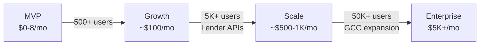
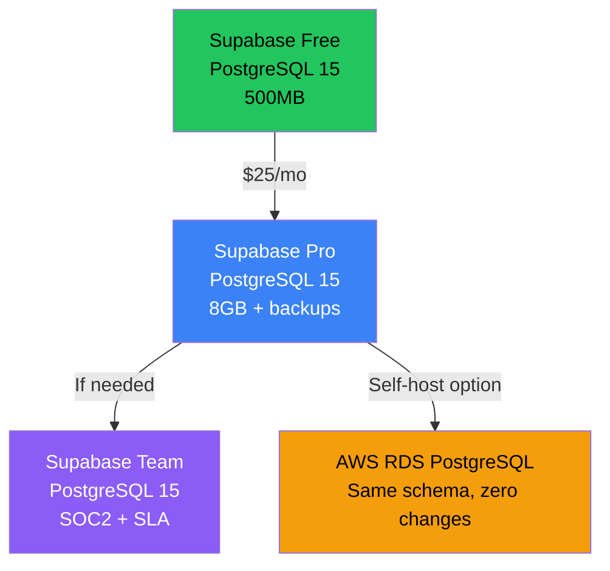

# MVP → Production Migration Roadmap

> What changes when OLFi goes from free-tier MVP to production-grade fintech platform.

---

## Migration Timeline



---

## Phase 1: Growth ($25-100/month)

**Trigger:** >500 active users, need for backups and monitoring

| Area | MVP (Current) | Growth | Why |
|:-----|:-------------|:-------|:----|
| **Database** | Supabase Free (500MB) | Supabase Pro ($25/mo, 8GB, daily backups) | Data safety, point-in-time recovery |
| **Auth** | Supabase Auth (50K users) | Same (included in Pro) | Already sufficient |
| **Edge Functions** | 500K invocations | 2M invocations (Pro) | More API calls for offer matching |
| **Storage** | 1GB | 100GB (Pro) | KYC documents, user uploads |
| **Email** | Supabase built-in | Resend ($20/mo, 50K emails) | Transactional emails, notifications |
| **Monitoring** | Console logs | Sentry ($0 free tier, 5K errors/mo) | Error tracking, crash reports |
| **Analytics** | None | PostHog ($0 free, 1M events/mo) | User behavior, conversion funnels |

### Code Changes Required
```diff
# Add Sentry
+ npm install @sentry/react-native
+ // Initialize in app entry point

# Add PostHog
+ npm install posthog-react-native
+ // Wrap app with PostHogProvider

# Add Resend (Edge Function)
+ // Create send-email Edge Function
```

---

## Phase 2: Scale ($500-1K/month)

**Trigger:** 5K+ users, lender API integrations, regulatory requirements

| Area | Growth | Scale | Why |
|:-----|:-------|:------|:----|
| **Database** | Supabase Pro (8GB) | Supabase Pro + read replicas | Query performance under load |
| **Compute** | Edge Functions only | Edge Functions + AWS Lambda (specific) | Heavy computation: credit analysis, ML |
| **Open Banking** | Mock/manual data | UAE Open Banking APIs (Central Bank framework) | Real bank account linking |
| **Credit Bureau** | Manual entry | AECB API integration | Real-time credit score retrieval |
| **Payments** | None | Stripe ($0 + 2.9% per txn) | Processing fees, subscriptions |
| **CDN** | Supabase default | CloudFront ($0.085/GB) | Fast asset delivery GCC-wide |
| **Push Notifications** | Expo Push (free) | OneSignal (free tier, 10K users) | Smart segmentation, scheduling |
| **KYC** | Manual verification | Onfido / Sumsub ($1-2/check) | Automated ID verification |
| **Sharia Engine** | Static contract templates | Dynamic contract generator (custom) | Murābaḥa, Tawarruq, Ijāra |

### Code Changes Required
```diff
# AWS Lambda for heavy compute
+ Create dedicated Lambda functions for:
+   - Credit risk scoring (Python + scikit-learn)
+   - Loan portfolio optimization
+   - Sharia contract generation
+ Connect via API Gateway → Supabase Edge Function proxy

# Open Banking Integration
+ Create banking-integration service module
+ Implement OAuth2 flow for bank account linking
+ Store tokenized credentials in encrypted column

# AECB Credit Bureau
+ Create credit-bureau Edge Function
+ Implement credit score polling + caching (24hr TTL)

# Stripe
+ npm install @stripe/stripe-react-native
+ Create payment Edge Functions (create-intent, webhook)
```

### Infrastructure Additions
```
Supabase (PostgreSQL + Auth + Functions)  ← stays as primary
    ↕
AWS Lambda (Python)                        ← heavy ML/AI compute only
    ↕
AWS API Gateway                            ← routes to Lambda
    ↕
AECB API / Open Banking APIs               ← external integrations
```

---

## Phase 3: Enterprise ($5K+/month)

**Trigger:** 50K+ users, GCC expansion, institutional lender partnerships

| Area | Scale | Enterprise | Why |
|:-----|:------|:-----------|:----|
| **Database** | Supabase Pro | Supabase Team ($599/mo) or self-hosted on AWS RDS | Compliance, SLA, SOC2 |
| **Compute** | Edge + Lambda | AWS ECS/Fargate (containerized services) | Microservices for each domain |
| **Security** | RLS + basic encryption | AWS KMS + HSM for key management | PCI-DSS adjacent compliance |
| **Queue** | Synchronous | AWS SQS/SNS | Async loan processing pipeline |
| **Caching** | None | AWS ElastiCache (Redis) | Sub-50ms offer lookups |
| **Logging** | Sentry + console | AWS CloudWatch + Datadog | Regulatory audit trails |
| **Multi-Region** | Single region | AWS Middle East (Bahrain) + backup | 99.9% uptime SLA |
| **Blockchain** | None | Hyperledger (optional) | Sharia compliance audit trail |

---

## What NEVER Changes

| Decision | Reason |
|:---------|:-------|
| **React Native / Expo** | Frontend stays the same regardless of backend |
| **TypeScript** | Type safety is non-negotiable for fintech |
| **PostgreSQL** | Even if moving off Supabase, PostgreSQL stays. Zero data migration |
| **Zustand state management** | Client-side architecture independent of backend |
| **Supabase client SDK** | Even with additional AWS services, Supabase remains primary data layer |
| **Xcode local builds** | Always build locally until CI/CD justifies EAS Build cost |

---

## Database Migration Path



> **Key insight:** Because Supabase uses standard PostgreSQL, migration to self-hosted or AWS RDS requires **zero schema changes**. Export with `pg_dump`, import with `pg_restore`. RLS policies, functions, triggers — all portable.

---

## Cost Projection

| Phase | Monthly Cost | Users | Revenue Expectation |
|:------|:-------------|:------|:-------------------|
| **MVP** | $0-8 | 0-500 | Pre-revenue, testing |
| **Growth** | $50-100 | 500-5K | Early traction, pilot lenders |
| **Scale** | $500-1K | 5K-50K | Revenue-generating, lender fees |
| **Enterprise** | $5K+ | 50K+ | Profitable, infrastructure = <5% of revenue |

---

## Checklist: When to Upgrade

- [ ] **Supabase Pro** — When DB exceeds 400MB or you need daily backups
- [ ] **Sentry** — After first TestFlight release
- [ ] **PostHog** — When you need conversion funnel data
- [ ] **Resend** — When you send >100 emails/day
- [ ] **AWS Lambda** — When you need ML/credit scoring
- [ ] **AECB API** — When regulatory sandbox access is granted
- [ ] **Open Banking** — When Central Bank API access is approved
- [ ] **Stripe** — When the first lender partnership is signed
- [ ] **KYC Provider** — When you need automated ID verification
