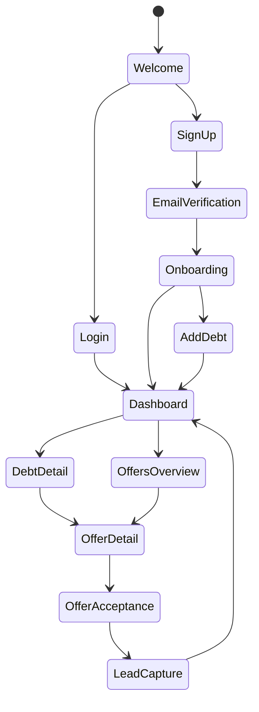

# Application Flow & Navigation — OLFi MVP

> Maps every screen, transition, and user journey in the app.

---

## 1. Navigation Structure

```
Tab Bar (Bottom)
├── 🏠 Dashboard (Home)
├── 📊 My Debts
├── 💰 Offers
├── 👤 Profile
```

**Modal Screens (overlay on any tab):**
- Add Debt Form
- Offer Detail + Comparison
- Offer Acceptance + Lead Capture
- Coming Soon Previews (UAE Pass, AECB)
- Credit Health Detail
- Notifications

---

## 2. Screen Specifications

### Auth Flow

| # | Screen | Route | Elements | Next |
|:--|:-------|:------|:---------|:-----|
| 1 | **Welcome** | `/welcome` | Logo, tagline "For every loan", Get Started button, "Already have account?" link | → Sign Up or Login |
| 2 | **Sign Up** | `/auth/signup` | Email input, password, OR divider, Google button, Apple button, UAE Pass button (→ Coming Soon), "Already have account?" | → Email Verification |
| 3 | **Login** | `/auth/login` | Email + password, OR divider, Google, Apple, UAE Pass (Coming Soon), "Forgot password?" | → Dashboard |
| 4 | **Email Verification** | `/auth/verify` | OTP/magic link confirmation, resend button | → Onboarding |
| 5 | **Forgot Password** | `/auth/reset` | Email input → reset link sent confirmation | → Login |

### Onboarding (First-Time Only)

| # | Screen | Route | Elements | Next |
|:--|:-------|:------|:---------|:-----|
| 6 | **Welcome Step** | `/onboarding/1` | "See all your debts in one place" + illustration, progress dots | → Step 2 |
| 7 | **Value Prop** | `/onboarding/2` | "Find better rates across banks" + illustration | → Step 3 |
| 8 | **CTA Step** | `/onboarding/3` | "Switch with one tap" + "Add Your First Debt" button, "Skip for now" | → Add Debt or Dashboard |

### Dashboard (Home Tab)

| # | Screen | Route | Access | Key Elements |
|:--|:-------|:------|:-------|:-------------|
| 9 | **Dashboard** | `/(tabs)/dashboard` | Auth required | Hero: Total Debt (AED) + Potential Monthly Savings (green). Credit Health Indicator. Debt cards list (scrollable). "Add Debt" FAB. Quick stats: total debts count, avg rate, best savings opportunity |

**Dashboard States:**
- Empty: "Add your first debt to get started" + CTA
- Loading: Skeleton shimmer
- Populated: Cards with debt summaries
- Error: Retry banner

### My Debts Tab

| # | Screen | Route | Key Elements |
|:--|:-------|:------|:-------------|
| 10 | **Debt List** | `/(tabs)/debts` | List of all debts with: bank logo, type badge, outstanding amount, rate, "See Offers" button. "Connect Bank" banner (→ Coming Soon). "Add Debt" button |
| 11 | **Debt Detail** | `/debts/[id]` | Full details: bank, type, amount, rate, tenure, monthly payment, compliance type. Payment progress bar. "Edit" and "Delete" actions. Offers available count → link to filtered offers |

### Add / Edit Debt (Modal)

| # | Screen | Route | Key Elements |
|:--|:-------|:------|:-------------|
| 12 | **Add Debt** | `/debts/add` | Form: Bank name (searchable picker), Debt type (4 options), Outstanding amount, Monthly payment, Interest/profit rate, Remaining tenure, Compliance (Sharia / Conventional / Not Sure). "Save" button |
| 13 | **Edit Debt** | `/debts/[id]/edit` | Same form, pre-filled with existing data |

### Offers Tab

| # | Screen | Route | Key Elements |
|:--|:-------|:------|:-------------|
| 14 | **Offers Overview** | `/(tabs)/offers` | Debt selector (horizontal scroll of user's debts). Filter toggles: Sharia Only, Lowest Rate, Shortest Tenure. Offer cards: bank logo, rate, tenure, EMI, savings vs current |
| 15 | **Offer Detail** | `/offers/[id]` | Side-by-side comparison: Current vs This Offer. Savings breakdown: monthly, total over tenure. Bank info + offer terms. "Accept Offer" CTA (green, prominent) |
| 16 | **Offer Acceptance** | `/offers/[id]/accept` | Step 1: Confirm details. Step 2: Success animation (Lottie checkmark). Step 3: Lead capture form (name, phone, preferred contact time). "Your application has been submitted to [Bank]. A OLFi advisor will contact you within 24 hours." |

### Application Tracker (Post-Offer Closing Journey)

| # | Screen | Route | Key Elements |
|:--|:-------|:------|:-------------|
| 17 | **My Applications** | `/(tabs)/dashboard` (section) | List of submitted applications with status badges: Submitted (blue), Under Review (amber), Docs Requested (orange), Approved (green), Rejected (red), Completed (green check). Tap any to see detail |
| 18 | **Application Detail** | `/applications/[id]` | Timeline view showing each status change with timestamp. Current status highlighted. Bank name + offer summary at top. Progress bar (visual pipeline). Action buttons based on status (e.g., "Upload Documents" when docs requested) |
| 19 | **Document Upload** | `/applications/[id]/upload` | Camera capture or file picker. Document type selector (Salary Certificate, Bank Statement, Emirates ID, Trade License, Other). Upload progress indicator. List of already-submitted documents |
| 20 | **Approval Screen** | `/applications/[id]/approved` | Celebration animation (Lottie confetti). New loan terms summary. "What happens next" — clear steps for the refinance execution. Bank contact info |
| 21 | **Rejection Screen** | `/applications/[id]/rejected` | Empathetic messaging: "This offer wasn't a match, but we have alternatives." Rejection reason (if provided by bank). "Browse Alternative Offers" CTA → filtered offers excluding this bank |

### Profile Tab

| # | Screen | Route | Key Elements |
|:--|:-------|:------|:-------------|
| 22 | **Profile** | `/(tabs)/profile` | User info card (name, email, avatar). Menu: Personal Details, Notification Settings, Credit Health, My Applications, OLFi Partners, Privacy & Security, About, Language, Rate Us, Invite Friends, Logout |
| 23 | **Personal Details** | `/profile/details` | Edit: name, phone, nationality, employment type, salary (optional with tooltip) |
| 24 | **Notification Settings** | `/profile/notifications` | Toggles: New offers, Payment reminders, Offer status updates, Application updates |
| 25 | **Credit Health** | `/profile/credit-health` | Health indicator (Healthy/Needs Attention/At Risk). Factors: number of debts, DBR estimate, payment consistency. "Connect AECB for real score" → Coming Soon. Disclaimer text |

### Coming Soon Modals

| Feature | Trigger | Modal Content |
|:--------|:--------|:-------------|
| **UAE Pass** | Tap UAE Pass button on auth screen | 3-screen animated preview: Verify Identity → Select Bank → Auto-Sync. "We're integrating UAE Pass. For now, sign up with email or social." |
| **AECB Bank Sync** | Tap "Connect Your Bank" | 3-screen preview: Connect → Select Accounts → Import Debts. "Automated bank sync coming soon. For now, add your debts manually." |
| **AECB Credit Score** | Tap "Connect AECB" on credit health | Preview of real score dashboard. "Official AECB score integration coming soon." |

---

## 3. User Flows

### Flow 1: First-Time User (Happy Path)
```
Welcome → Sign Up (Email) → Verify Email → Onboarding (3 steps)
→ Add First Debt → Dashboard (1 debt showing)
→ Browse Offers → Compare → Accept Offer
→ Lead Capture → Dashboard (with "Submitted" badge)
→ [Later] Push notification: "Under Review" → tap → Application Detail
→ [Later] Push notification: "Documents Requested" → Upload salary cert
→ [Later] Push notification: "Approved!" → Celebration screen → New loan terms
```

### Flow 2: Returning User
```
App Open → Biometric Auth → Dashboard
→ See application status badges on dashboard
→ Notification: "ADIB has approved your refinance!"
→ Tap → Approval Screen → See new terms + next steps
```

### Flow 3: Investor Demo
```
Sign Up → Add 3 sample debts (mix of personal, auto, card)
→ Dashboard shows total + savings
→ Tap "Connect Your Bank" → See Coming Soon preview
→ Browse offers → Show Sharia filter
→ Accept offer → Lead capture flow
→ Profile → Credit Health → Show Coming Soon AECB
```

---

## 4. State Transitions



---

## 5. Error Handling UX

| Error | Screen | Handling |
|:------|:-------|:---------|
| Network offline | Any | Banner: "You're offline. Some features may be limited." |
| Auth failed | Login | Inline error: "Invalid email or password" |
| Invalid debt data | Add Debt | Field-level validation with Zod. Red border + message |
| Session expired | Any | Modal: "Session expired. Please sign in again." → Login |
| Server error | Any | Full-screen: "Something went wrong" + Retry button |

---

## 6. Deep Linking (Future)

| Link | Destination |
|:-----|:------------|
| `buyout://dashboard` | Dashboard |
| `buyout://debts/add` | Add Debt form |
| `buyout://offers?debt=123` | Offers filtered for specific debt |
| `buyout://notifications` | Notification settings |
